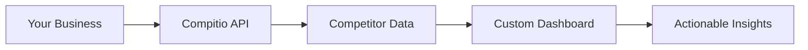

## Overview

Compitio empowers businesses to gain a competitive edge through intelligent monitoring and analysis tools. You track competitors, analyze market trends, and build custom dashboards to inform strategic decisions. Designed for marketers, product managers, and executives, Compitio delivers actionable insights with minimal setup.

<Callout kind="info">
  Compitio is currently under development. Visit the site soon for the latest updates and full launch details.
</Callout>

## Key Features

Discover Compitio's primary functionalities through these core capabilities.

<Columns cols={3}>
  <Card title="Real-Time Monitoring" icon="zap" href="#real-time-monitoring">
    Track competitor websites, pricing, and social activity in real time.
  </Card>
  <Card title="Trend Analysis" icon="trending-up" href="#trend-analysis">
    Identify market shifts using AI-powered data aggregation.
  </Card>
  <Card title="Custom Dashboards" icon="settings" href="#custom-dashboards">
    Build personalized views with drag-and-drop widgets.
  </Card>
</Columns>

## Target User Workflows

Compitio adapts to your role. Switch between tailored workflows below.

<Tabs>
  <Tab title="Marketers" icon="users">
    Monitor campaigns and benchmark performance against rivals.

    ```javascript
    // Fetch competitor ad data
    const response = await fetch('https://api.example.com/v1/competitors/{competitorId}/ads', {
      headers: { Authorization: `Bearer ${YOUR_API_KEY}` }
    });
    const ads = await response.json();
    console.log(ads);
    ```
  </Tab>
  <Tab title="Product Managers" icon="package">
    Analyze feature launches and user feedback loops.

    ```python
    import requests

    response = requests.get(
        'https://api.example.com/v1/products/{productId}/features',
        headers={'Authorization': f'Bearer {YOUR_API_KEY}'}
    )
    features = response.json()
    print(features)
    ```
  </Tab>
  <Tab title="Executives" icon="bar-chart">
    Review high-level KPIs and strategic recommendations.

    <Image
      src="https://via.placeholder.com/800x400/7b7b7b/ffffff?text=Executive+Dashboard"
      alt="Compitio executive dashboard overview"
      width="800"
      height="400"
    />
  </Tab>
</Tabs>

## Business Applications

Apply Compitio in real scenarios. Follow this step-by-step process to set up competitor tracking.

<Steps>
  <Step title="Connect Data Sources" icon="link">
    Integrate your tools via API.

````javascript
// Example API integration
await fetch('https://api.example.com/v1/integrations', {
  method: 'POST',
  body: JSON.stringify({ source: 'google-analytics' })
});
````

  </Step>
  <Step title="Define Competitors" icon="target">
    Add rivals using domain search.
  </Step>
  <Step title="Launch Monitoring" icon="play">
    Activate alerts for changes.
  </Step>
  <Step title="Review Insights" icon="eye">
    Access dashboard for reports.
  </Step>
</Steps>

## Customization Options

Tailor Compitio to your needs with flexible configurations.

<CodeGroup tabs="Dashboard Config,Alert Rules">
````javascript
// Dashboard widget configuration
const dashboardConfig = {
  widgets: [
    { type: 'chart', data: 'competitor-traffic' },
    { type: 'table', query: 'pricing-changes' }
  ]
};
````
````javascript
// Custom alert rules
const alertRule = {
  trigger: '>10% traffic drop',
  notify: 'slack:your-webhook-url.com/webhook'
};
````
</CodeGroup>

<Expandable title="Advanced Custom Metrics" default-open="false">

Define your own KPIs using the metrics API.

```javascript
// Create custom metric
await fetch('https://api.example.com/v1/metrics', {
  method: 'POST',
  body: JSON.stringify({
    name: 'custom-engagement',
    formula: '(clicks / impressions) * 100'
  })
});
```

</Expandable>

## Performance Highlights

Compitio scales effortlessly for enterprise needs.

| Metric              | Performance                  |
|---------------------|------------------------------|
| Data Processing     | `<1s` per query             |
| Uptime              | `>99.99%`                   |
| Concurrent Users    | `>10,000`                   |
| Data Retention      | Unlimited with Pro plan     |

<Callout kind="success">
  Users report `50%` faster decision-making with Compitio's insights.
</Callout>



Ready to explore? Start with [quickstart](/quickstart) for hands-on setup.