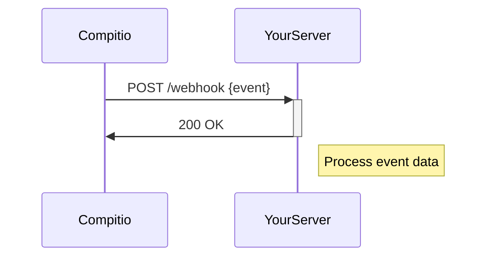

## Overview

Compitio supports seamless integrations with popular third-party tools, allowing you to automate workflows, sync data, and extend functionality. You can connect via webhooks for real-time updates, use our REST API for custom builds, or leverage pre-built integrations with services like Slack and GitHub.

<Callout kind="tip">
  Start with our pre-built integrations for quick setup, then explore webhooks and API for advanced use cases.
</Callout>

## Supported Integrations

Compitio offers native support for several tools. Choose from these to get started immediately.

<Columns cols={3}>
  <Card title="Slack" icon="message-circle" href="https://slack.com">
    Send notifications for events like user signups or task completions.
  </Card>
  <Card title="GitHub" icon="github" href="https://github.com">
    Sync repositories, automate PR reviews, and track issues.
  </Card>
  <Card title="Zapier" icon="zap" href="https://zapier.com">
    Build no-code automations with 5000+ apps.
  </Card>
</Columns>

## Webhook Setup Guide

Set up webhooks to receive real-time events from Compitio. Follow these steps to configure a webhook endpoint on your server.

<Steps>
  <Step title="Create Webhook Endpoint" icon="server">
    Expose a public HTTPS endpoint on your server to receive POST requests from Compitio.

````javascript
const express = require('express');
const app = express();
app.use(express.json());

app.post('/webhook', (req, res) => {
  console.log('Event:', req.body);
  res.status(200).json({ received: true });
});

app.listen(3000);
````
  </Step>
  <Step title="Register Webhook" icon="plus">
    Use the Compitio dashboard to add your endpoint URL.
  </Step>
  <Step title="Verify Events" icon="check-circle">
    Test the webhook and handle events like `user.created` or `task.completed`.
  </Step>
</Steps>



## Custom API Integrations

Build custom integrations using our REST API at `https://api.example.com/v1`. Authenticate requests with your API key in the `Authorization` header.

<ParamField header="Authorization" param-type="string" required="true">
  Bearer `{YOUR_API_KEY}`.
</ParamField>

<ParamField query="limit" param-type="integer" required="false">
  Number of results to return (default: 50, max: 100).
</ParamField>

Here is an example request to fetch integrations:

<Request tabs="JavaScript,cURL">
  ````javascript
  const response = await fetch('https://api.example.com/v1/integrations', {
    headers: {
      'Authorization': 'Bearer YOUR_API_KEY'
    }
  });
  const data = await response.json();
  console.log(data);
  ````
  ````bash
  curl -H "Authorization: Bearer YOUR_API_KEY" \
       https://api.example.com/v1/integrations
  ````
</Request>

<Response tabs="200">
````json
{
  "integrations": [
    {
      "id": "int_123",
      "name": "slack",
      "status": "active"
    }
  ]
}
````
</Response>

## Data Syncing Methods

Sync data between Compitio and external services using these methods. Select the best approach for your needs.

<Tabs>
  <Tab title="Push (Webhooks)" icon="arrow-up-circle">
    Compitio pushes updates to your endpoint in real-time.

    <CodeGroup tabs="Node.js,Python">
      ````javascript
      app.post('/sync', (req, res) => {
        const { event, data } = req.body;
        // Update your database
        updateDatabase(data);
        res.json({ status: 'synced' });
      });
      ````
      ````python
      from flask import Flask, request
      app = Flask(__name__)

      @app.route('/sync', methods=['POST'])
      def sync():
          data = request.json
          # Update your database
          update_db(data)
          return {'status': 'synced'}
      ````
    </CodeGroup>
  </Tab>
  <Tab title="Pull (Polling)" icon="arrow-down-circle">
    Periodically fetch data from Compitio API.

    Use a cron job or scheduler to call `/v1/events?since={timestamp}` every 5 minutes.
  </Tab>
</Tabs>

## Partnership Ecosystem

Explore our growing partner network for co-built solutions.

<Columns cols={2}>
  <Card title="AWS Marketplace" icon="cloud" href="https://aws.amazon.com/marketplace" horizontal>
    Deploy Compitio on AWS with one-click templates.
  </Card>
  <Card title="Google Workspace" icon="google" href="https://workspace.google.com" horizontal>
    Native calendar and drive integrations.
  </Card>
</Columns>

<Callout kind="info">
  Request a new integration or partnership at `support@compitio.com`.
</Callout>