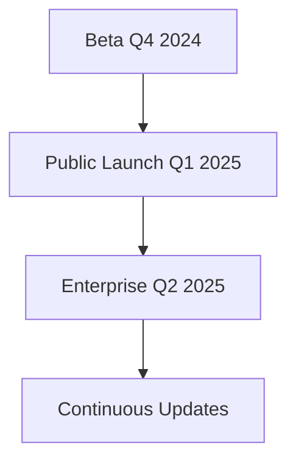

## Overview

Compitio represents the next generation of innovative business solutions, currently under active development. You will soon access a comprehensive platform designed to streamline your workflows, enhance productivity, and deliver cutting-edge services tailored to modern needs. Our mission focuses on empowering users with intuitive tools that adapt to your requirements, fostering growth and efficiency from day one.

<Callout kind="info">
  The Compitio website launches soon. Stay tuned for full access to documentation, demos, and signup.
</Callout>

## Company Background and Mission

Founded by Asliddin Muzafarzoda, Compitio builds on years of expertise in software development and business optimization. We aim to bridge gaps in current solutions by offering scalable, user-centric services that prioritize reliability and innovation.

Our core values include transparency, adaptability, and user empowerment. You benefit from a platform that evolves with feedback, ensuring it meets real-world demands.

## Key Upcoming Features

Compitio introduces powerful capabilities to transform how you manage projects and data.

<Columns cols={3}>
  <Card title="Real-Time Collaboration" icon="users" href="#collaboration">
    Work seamlessly with teams across locations, with live updates and version control.
  </Card>
  <Card title="AI-Powered Insights" icon="zap" href="#insights">
    Gain actionable analytics from your data using intelligent algorithms.
  </Card>
  <Card title="Seamless Integrations" icon="link" href="#integrations">
    Connect effortlessly with tools like Slack, GitHub, and custom APIs.
  </Card>
</Columns>

## Roadmap and Launch Timeline

Follow our structured path to full availability.

<Steps>
  <Step title="Beta Access" icon="play-circle">
    Join the early beta in Q4 2024. Sign up at `https://compitio.com/beta` to test core features.
  </Step>
  <Step title="Public Launch" icon="rocket">
    Full release expected Q1 2025, including all premium features and documentation.
  </Step>
  <Step title="Enterprise Rollout" icon="shield">
    Scalable enterprise plans launch Q2 2025, with dedicated support.
  </Step>
</Steps>



## Why Choose Compitio

Discover what sets us apart through key differentiators.

<Tabs>
  <Tab title="Performance" icon="zap">
    Compitio delivers sub-second response times, even at scale. Unlike legacy systems, you experience no lag during peak usage.
  </Tab>
  <Tab title="Security" icon="shield">
    End-to-end encryption and compliance with GDPR/CCPA standards protect your data.
  </Tab>
  <Tab title="Ease of Use" icon="settings">
    Intuitive dashboards require zero training. Customize views in minutes.
  </Tab>
</Tabs>

## Contact and Support

Ready to engage? Reach out directly.

- **Email:** support@compitio.com
- **Discord:** Join our community at `https://discord.gg/compitio`
- **Future Dashboard:** Access at `https://dashboard.compitio.com` post-launch

<Callout kind="tip">
  Bookmark this page and check back soon for quickstart guides and API docs. Follow us on GitHub for updates.
</Callout>

<Expandable title="Future Integration Example" default-open="false">

Once launched, integrate Compitio easily.

<CodeGroup tabs="JavaScript,Python">
  ```javascript
  const compitio = require('compitio-sdk');
  
  const client = new compitio.Client({ apiKey: 'YOUR_API_KEY' });
  const projects = await client.projects.list();
  console.log(projects);
  ```
  ```python
  from compitio import Client
  
  client = Client(api_key='YOUR_API_KEY')
  projects = client.projects.list()
  print(projects)
  ```
</CodeGroup>

</Expandable>